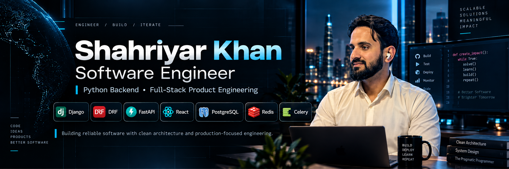

<p align="center">
  
</p>

## Professional Profile

I am a **Software Engineer specializing in Python backend and full-stack product engineering**, building production APIs, internal systems, and complete web products with **Python, Django, Django REST Framework, FastAPI, PostgreSQL, Redis/Celery, React, and Next.js**.

My work spans **client platforms, education/LMS products, AI-enabled workflows, authentication and RBAC, admin and operational tooling, analytics, exports, background processing, testing, CI/CD, Docker, and cloud deployment**. I focus on practical architecture: clear modules, secure access boundaries, maintainable data models, testable workflows, and infrastructure that fits the real needs of the product.

I currently work **contract-based with TriCore Digital Tech** and am open to **international remote Software Engineer / Backend Engineer / Python-Django / Full-Stack opportunities**, contract collaborations, and selected freelance product development.

**[LinkedIn](https://www.linkedin.com/in/shahriyar-kh/)** · **[Email](mailto:shahriyarkhanpk1@gmail.com)** · **[GitHub](https://github.com/Shahriyar-Kh)** · **[Portfolio](https://shahriyarkhan.com)**

---

## Core Engineering Strengths

- **Backend & API Engineering** — Django/DRF, FastAPI, REST APIs, validation, authentication, permissions, JWT and RBAC
- **Full-Stack Product Delivery** — React/Next.js applications connected to production backend services
- **Data & Background Systems** — PostgreSQL, Redis, Celery, relational modeling, caching, queues, exports and analytics
- **Production Quality** — pytest, Vitest, linting, type checks, CI/CD, Docker, migration checks and deployment workflows
- **Operational Product Thinking** — admin systems, internal tools, client workflows, user journeys and maintainable business operations
- **Applied AI Integration** — grounded assistants, structured AI outputs, quotas and provider integrations where AI supports a real product need

---

## Featured Engineering Work

### Portfolio Platform
**Next.js · React · Django REST Framework · PostgreSQL · Cloudflare · Railway**

A production-oriented personal engineering platform rather than a static portfolio. It includes dynamic project and service content, structured client project discovery, a grounded visitor assistant, private CV/resume operations, SEO/JSON-LD and CI.

**Engineering evidence:** full-stack architecture, internal tooling, AI boundaries, document workflows, SEO and deployment.

**[Repository](https://github.com/Shahriyar-Kh/shahriyarkhan-portfolio-v1)** · **[Live](https://shahriyarkhan.com)**

---

### NoteAssist AI
**Django · DRF · React · PostgreSQL · Redis · Celery · Groq · Google OAuth/Drive**

A deployed learning-productivity platform for structured notes, AI-assisted study workflows, plans/quotas, Google integrations, exports, dashboards and administration.

**Engineering evidence:** async processing, third-party integrations, quota controls, AI workflows and admin operations.

**[Repository](https://github.com/Shahriyar-Kh/noteassist_ai)** · **[Live](https://noteassistai.vercel.app/)**

---

### Yango Wing Fleet
**Django REST Framework · React · TypeScript · PostgreSQL · JWT**

A client operations platform supporting driver onboarding, inquiries, protected staff APIs, offers/trip bonuses, filtering, CSV exports and dashboard analytics.

**Engineering evidence:** real business workflows, staff authorization, operational dashboards, server-side filtering and exports.

**[Repository](https://github.com/Shahriyar-Kh/yango-wing-fleet)** · **[Live](https://yango-wing-fleet.vercel.app/)**

---

### TechBuilt Open School
**Django 5.2 · DRF · Next.js · PostgreSQL · Redis · Celery · OpenAPI · TypeScript**

A public-safe engineering showcase for a multilingual education platform being developed with API contracts, explicit identity/authorization boundaries, multilingual/RTL foundations and phased engineering governance.

**Engineering evidence:** modular-monolith architecture, API contracts, security boundaries, multilingual foundations and CI/security gates.

**[Public Engineering Showcase](https://github.com/Shahriyar-Kh/TechBuilt_OS)**

---

### Nurses Beyond Borders — LMS Case Study
**Django/DRF · Next.js · Assessment Workflows · Analytics · Docker**

Private client source with a public-safe engineering case study covering NCLEX/NGN assessment workflows, entitlements, analytics, testing and VPS deployment design.

**Engineering evidence:** complex education workflows, role/entitlement boundaries, analytics, testing and deployment design.

**[Read Case Study](./case-studies/nbb-lms.md)**

---

<details>
<summary><strong>Additional selected work</strong></summary>

### SK LearnTrack
**Django REST Framework · React · PostgreSQL · JWT · Groq AI**

Learning and course-management platform with course authoring, enrollment/progress workflows, notes, roadmaps, analytics and AI-assisted learning features.

**[Repository](https://github.com/Shahriyar-Kh/SK_LearnTrack)** · **[Live](https://sk-learntrack.vercel.app/)**

### FeelWise
**FastAPI · Node.js/Express · MongoDB · PyTorch · DeepFace · Wav2Vec2**

Multi-service portfolio project coordinating text, facial-expression, speech and journal analysis workflows through an API gateway and specialized Python services.

**[Repository](https://github.com/Shahriyar-Kh/feelwise-emotion-detection)**

</details>

---

## Technical Stack

**Backend**  
`Python` · `Django` · `Django REST Framework` · `FastAPI` · `REST APIs` · `JWT` · `RBAC` · `OpenAPI`

**Frontend**  
`React` · `Next.js` · `TypeScript` · `JavaScript` · `Vite` · `Tailwind CSS`

**Data & Background Processing**  
`PostgreSQL` · `Redis` · `Celery` · `MongoDB` · `MySQL` · `SQLite` · `Supabase`

**Testing & Delivery**  
`pytest` · `pytest-django` · `Vitest` · `GitHub Actions` · `Docker` · `Postman`

**Cloud & Deployment**  
`Render` · `Vercel` · `Railway` · `Cloudflare`

---

## Engineering Approach

I prefer the **simplest architecture that preserves clear responsibilities and reliable delivery**.

```text
Client
  ↓
Versioned API
  ↓
Application / service layer
  ↓
Domain + persistence
  ↓
PostgreSQL / Redis / background workers
```

For many product systems, that means a **well-structured modular monolith first**. I separate services when isolation, scaling, ownership, deployment or reliability requirements justify the additional complexity.

---

## GitHub Activity

<div align="center">
  
</div>

---

## Current Focus

- Production-focused **Python/Django backend engineering**
- API architecture, authentication, permissions and operational tooling
- Testing, CI/CD, Docker and deployment maturity
- Building **TechBuilt Open School**
- Engineering content around real implementation decisions and trade-offs

---

## Work With Me

I am open to **international remote engineering roles, contract opportunities, and selected freelance product builds** where strong backend architecture, full-stack delivery, or production-focused Python/Django engineering can add value.

**LinkedIn:** https://www.linkedin.com/in/shahriyar-kh/  
**Email:** shahriyarkhanpk1@gmail.com  
**GitHub:** https://github.com/Shahriyar-Kh  
**Portfolio:** https://shahriyarkhan.com *(refresh planned)*

