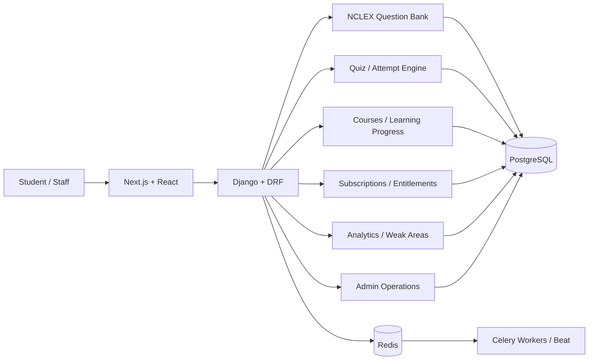

# Nurses Beyond Borders — NCLEX Learning Platform

## Public Engineering Case Study

This document is a **sanitized engineering case study** for a private client project.

The source repository remains private. This page intentionally excludes credentials, client-internal operational data, private requirements, commercial details, learner data, and deployment secrets.

**Public frontend preview:** https://nbb-lms.vercel.app/

---

## Engineering Scope

The platform was developed as a full-stack NCLEX learning and assessment product using:

- Python
- Django 5
- Django REST Framework
- Next.js 14
- React 18
- TypeScript
- PostgreSQL 16
- Redis
- Celery + Celery Beat
- JWT
- Docker
- Caddy-oriented VPS production design

The engineering work covered requirements interpretation, domain modeling, backend/API implementation, frontend product workflows, testing, CI quality gates, and production deployment preparation.

---

## High-Level Architecture



The backend uses a modular-monolith approach so transactional learning, assessment, entitlement, and operational workflows remain consistent without premature microservice complexity.

---

## Assessment Engineering

Public-safe product/engineering evidence includes:

- single-choice question workflows
- select-all-that-apply (SATA)
- matrix / NGN-style interaction support
- case-study grouping
- category/system/tag taxonomy
- review/approval/publish lifecycle
- timed quiz attempts
- autosave / expiry behavior
- frozen attempt snapshots
- deterministic scoring
- post-attempt review

A key implementation decision is that historical attempts are evaluated from their stored question snapshot rather than silently changing when source questions are later edited.

---

## Learning & Entitlement Workflows

The platform includes engineering around:

- course/module/lesson hierarchy
- lesson progress
- access entitlement checks
- subscription lifecycle states
- ad-hoc grants
- learning-state tracking
- study planning
- recommendations
- notifications
- analytics / weak-area signals

Course structure and access entitlement are separate concerns rather than one overloaded visibility flag.

---

## Quality Evidence

The private repository contains substantial automated testing and CI evidence.

Recorded repository evidence includes:

- **1069 passing backend tests** in the documented full backend run
- enforced backend coverage floor of **80%**
- ownership / authorization regressions
- idempotency tests
- query-count invariance tests
- service/view/model tests
- migration and Django checks
- frontend TypeScript and lint gates
- Vitest unit tests
- production Next.js build checks
- Storybook build checks
- Playwright E2E workflow for controlled environments

Frontend documentation records roughly **700+ unit tests across about 150 files**.

These numbers are included only because they are recorded in the private engineering documentation; they are not presented as external performance benchmarks.

---

## Deployment Design

The prepared production topology uses:

```text
Internet
   ↓
Custom domain / HTTPS
   ↓
Reverse proxy
   ↓
Next.js frontend + Django/Gunicorn backend
   ↓
PostgreSQL + Redis
   ↓
Celery worker + beat
```

The repository contains Docker/production deployment assets, backup/restore tooling, smoke checks, and deployment runbooks.

The final custom-domain/VPS cutover is treated separately from application implementation and public frontend preview.

---

## My Engineering Role

**Shahriyar Khan — Software Engineer / Full-Stack Python Developer**

Work represented in the private repository includes:

- requirements-to-implementation translation
- Django/DRF backend engineering
- React/Next.js frontend development
- domain/service architecture
- assessment and entitlement workflows
- testing / CI
- deployment preparation
- post-development hardening

---

## Confidentiality Boundary

This case study intentionally does **not** publish:

- repository source
- secrets or environment values
- client-private business logic
- learner/customer data
- private requirements documents
- payment/provider credentials
- internal infrastructure access
- proprietary content datasets

The goal is to show software-engineering evidence without turning a client repository into a public code dump.
